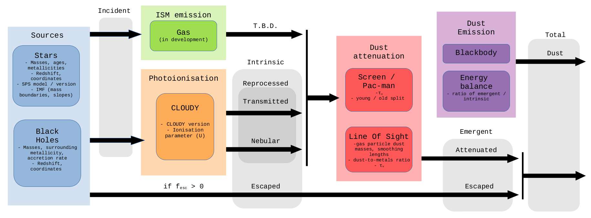

Spectra
********

Synthesizer enables the generation of multiple different spectra which are associated with galaxies (Galaxy objects) or their components. The flowchart below shows how these different spectra are generated by different components. Full details on each component are provided below.

Components
----------

* ``incident`` spectra are the spectra that serve as an input to the photoionisation modelling. In the context of stellar population synthesis these are the spectra that are produced by these codes and equivalent to the "pure stellar" spectra.

* ``transmitted`` spectra is the incident spectra that is transmitted through the gas in the photoionisation modelling. Functionally the main difference between ``transmitted`` and ``incident`` is that the ``transmitted`` has little flux below the Lyman-limit, since this has been absorbed by the gas. This depends on ``fesc``.

* ``nebular`` is the nebular continuum and line emission predicted by the photoionisation model. This depends on ``fesc``.

* ``reprocessed`` is the emission which has been reprocessed by the gas. This is the sum of ``nebular`` and ``transmitted`` emission. 

* ``escaped`` is the incident emission that escapes reprocessing by gas. This is ``fesc * incident``. This is not subsequently affected by dust.

* ``intrinsic`` is the sum of the ``escaped`` and ``reprocessed`` emission, essentially the emission before dust attenuated.

* ``attenuated`` is the ``reprocessed`` emission with attenuation by dust.

* ``emergent`` is the combined emission including dust attenuation and is the sum of ``reprocessed_attenuated`` and ``escaped``. NOTE: this does not include thermal dust emission, so is only valid from the UV to near-IR.

* ``dust`` is the thermal dust emission calculated using an energy balance approach, and assuming a dust emission model.

* ``total`` is the sum of ``attenuated`` and ``dust``, i.e. it includes both the effect of dust attenuation and dust emission.

* For two component dust models (e.g. Charlot & Fall 2000) we also generate the individual spectra of the young and old component. This includes ``young_incident``, ``young_nebular``, ``young_attenuated`` etc. ``young`` and ``old`` are equivalent to ``total`` for the young and old components.
